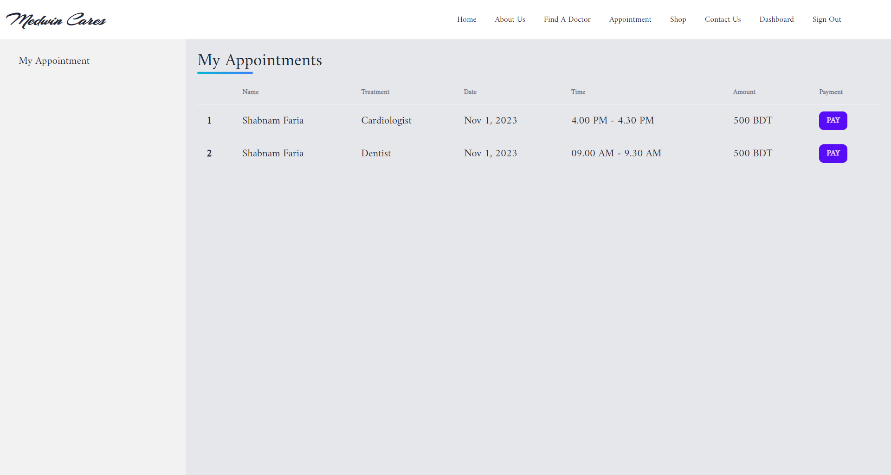
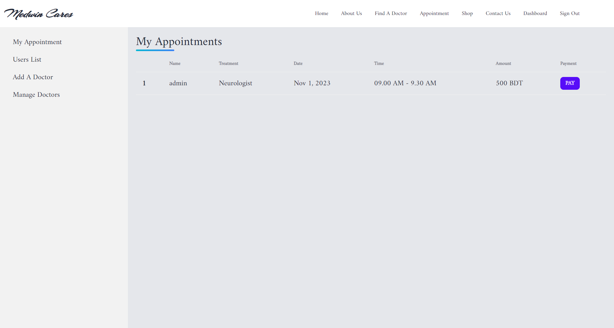
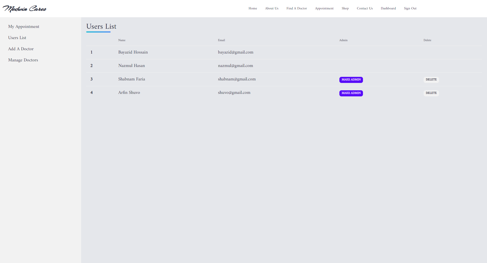
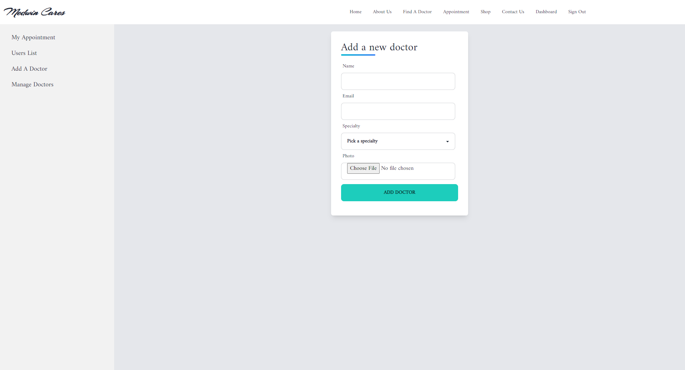
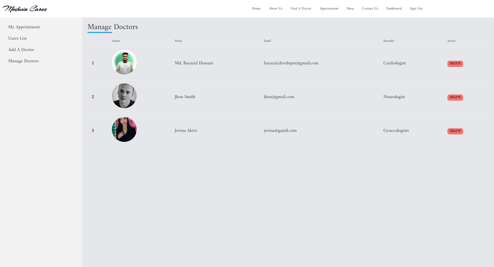

# Medwin Cares - Hospital Management System

[Live Site](https://linktodocumentatiodddn)

## Documentation

"Medwin Cares" is a comprehensive hospital management system featuring user and admin dashboards, seamless payment processing, and a patient-centric approach that enables medication purchases.
## Front-End Technologies

- React.js

- Tailwind CSS
- Swiper.js
- React Day Picker
- React Query
- React-router-dom

## Back-End Technologies

- Node.js

- Express.js
- Json Web Token
- MongoDB

## Authentication & Hosting Technologies

- Firebase

- Vercel

## Authors

- [@xbayazid](https://github.com/xbayazid)

***Home***

***About Us***

***Find A Doctor***

***Doctor Details***

***Department Details***

***Appointment***

***Contact Us***

***Login***

***Sign Up***

***User Dashboard***

***Admin Dashboard***

***Users List***

***Add a doctor***

***Manage Doctors***

