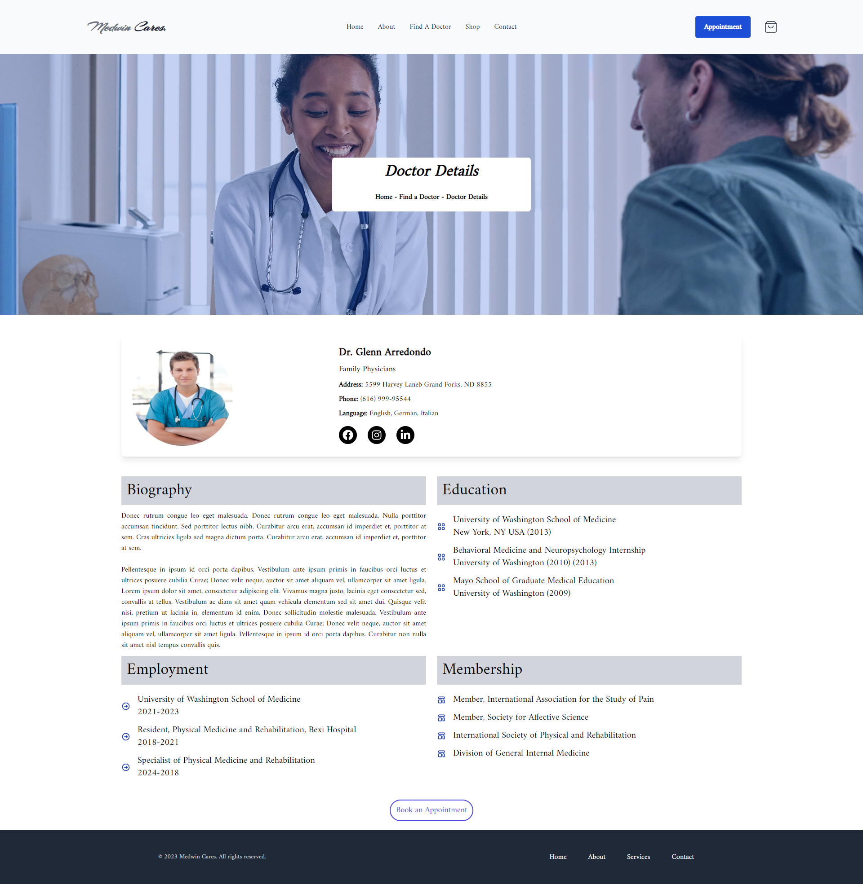

# Medwin Cares - Hospital Management System

[Live Site](https://medwin-cares-client-x3ro.vercel.app/)

## Documentation

"Medwin Cares" is a comprehensive hospital management system featuring user and admin dashboards, seamless payment processing, and a patient-centric approach that enables medication purchases.

## Medwin Cares has four different types of dashboard layouts.
***1.User Dashboard***
Here, the User can see his booked appointments list with the meet link and orders list. And, also can request to become a doctor.
**User login information**
Email: prodan@gmail.com
Password: bayazid

***Doctor Dashboard*** 
Here, the Doctor can see his patient list. Also, can add himself as a doctor with the necessary information after the admin approves his doctor request.
**Doctor login information**
Email: jorina@gmail.com
Password: bayazid

***Receptionist Dashboard***
Here, the Receptionist dashboard is mainly created for the people who don't have the proper knowledge of technology. And, don't know how to create and book an appointment and order medicine. So, if a patient contacts us through a phone call who wants to book an appointment the receptionist will create an account for him/her and book the appointment.
**Receptionist login information**
Email: saif@gmail.com
Password: bayazid

***Admin Dashboard***
Here the Admin has all the access to this web application as a hospital administration.
**Admin login information**
Email: admin@gmail.com
Password: bayazid

## Front-End Technologies

- React.js

- Tailwind CSS
- Swiper.js
- React Day Picker
- React Query
- React-router-dom

## Back-End Technologies

- Node.js

- Express.js
- MongoDB

## Authentication & Hosting Technologies

- Firebase

- Vercel

## Authors

- [@xbayazid](https://github.com/xbayazid)

***Home***

***About Us***

***Find A Doctor***

***Doctor Details***

***Department Details***

***Appointment***

***Contact Us***

***Login***

***Sign Up***

***User Dashboard***

***Admin Dashboard***

***Users List***

***Add a doctor***

***Manage Doctors***

